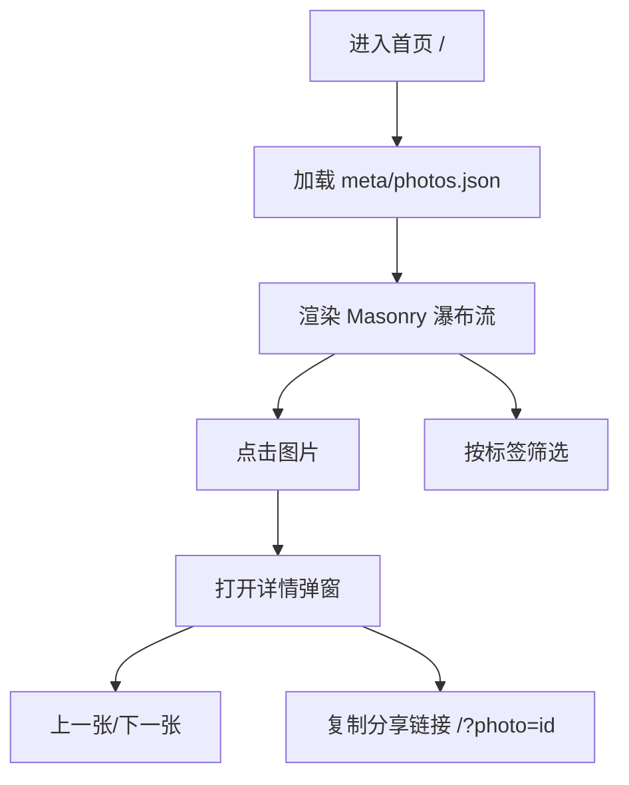
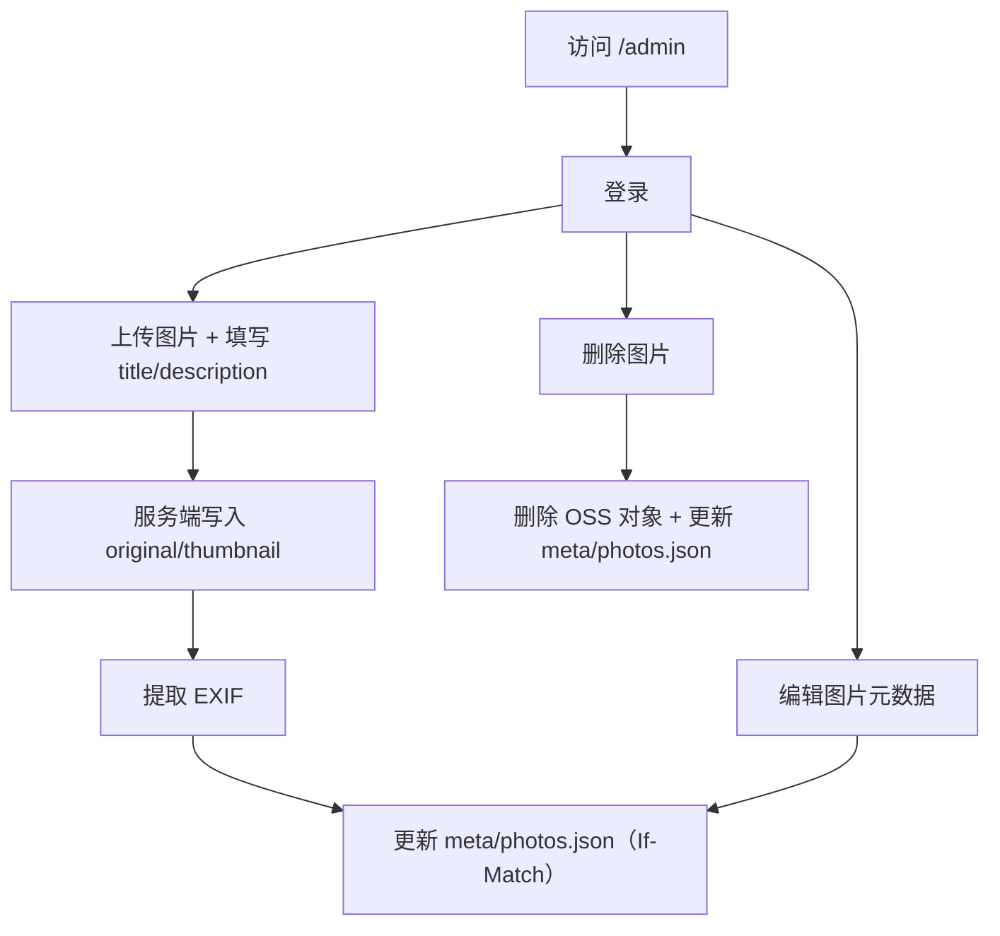

# 摄影作品展示网站（Charles 的相册）- 产品需求文档

## 1. 产品概述
一个面向个人摄影作品的极简展示网站：首页即作品瀑布流，点击图片在当前页以近全屏弹窗查看详情；提供 /admin 图片管理后台用于上传与维护元数据。

## 2. 核心功能

### 2.1 用户角色
| 角色 | 使用方式 | 核心权限 |
|------|----------|----------|
| 访客 | 直接访问 | 浏览作品列表、打开详情弹窗、按标签筛选、分享链接 |
| 管理员 | 密码登录 | 访问 /admin，上传/编辑/删除图片与元数据 |

### 2.2 功能模块
1. **首页（作品列表）**：顶部视觉区 + Masonry 瀑布流列表 + 标签筛选 + 详情弹窗
2. **图片管理页（/admin）**：登录 + 图片列表查询 + 上传 + 编辑 + 删除

### 2.3 页面详情
| 页面名称 | 模块名称 | 功能描述 |
|----------|----------|----------|
| 首页（/） | 顶部视觉区 | 高度约 50vh；居中布局；背景图（相机照片）+ 头像 + 标题“Charles的相册” |
| 首页（/） | Masonry 瀑布流 | 定宽列约 300px；列数随容器宽度自适应；保持图片原始比例；默认按时间倒序；支持 order 置顶 |
| 首页（/） | 标签筛选 | 基于 tags 数组筛选 |
| 首页（/） | 详情弹窗 | 当前页近全屏弹窗展示大图与信息；支持上一张/下一张；分享链接 `/?photo=PHOTO_ID` |
| 图片管理（/admin） | 登录 | 管理员密码登录；HttpOnly Cookie；有效期 7 天 |
| 图片管理（/admin） | 图片列表 | 查询全部图片；支持分页/筛选（可先实现基础分页与关键字/标签筛选） |
| 图片管理（/admin） | 上传 | 服务端转发上传原图；填写 title、description；生成 thumbnail；提取 EXIF；写入 meta/photos.json |
| 图片管理（/admin） | 编辑 | 可编辑 description、tags 等元信息（并允许查看/修改 takenAt、location、exif、isPublic、order） |
| 图片管理（/admin） | 删除 | 删除图片（original + thumbnail）并从 meta/photos.json 移除 |

## 3. 核心流程

### 3.1 访客浏览流程
- 访客打开首页（/）进入作品瀑布流
- 点击某张作品打开详情弹窗
- 可复制当前作品链接并分享（链接打开后自动弹出对应作品）
- 可按标签筛选作品

### 3.2 管理员维护流程
- 管理员访问 /admin 并登录
- 上传图片时填写 title/description
- 系统生成缩略图、提取 EXIF，并写入 meta/photos.json
- 管理员可编辑 tags 等字段，或删除图片

## 4. 界面设计
### 4.1 设计风格
- 整体：克制、以图片为主、留白明确
- 主题：暗色/亮色可切换，默认跟随系统
- 视觉重点：作品本身与顶部视觉区（背景图 + 头像 + 标题）
- 交互：减少打扰；弹窗近全屏；键盘左右切换、Esc 关闭（桌面端）

### 4.2 响应式
- 移动端优先，兼顾电脑端
- Masonry：列宽约 300px，列数随容器宽度变化

