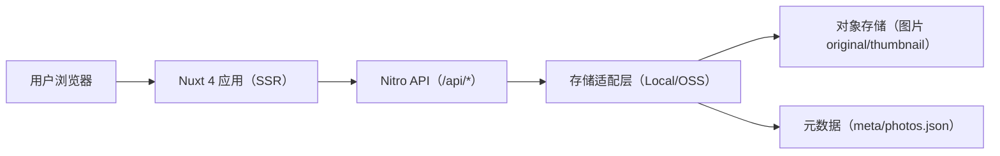
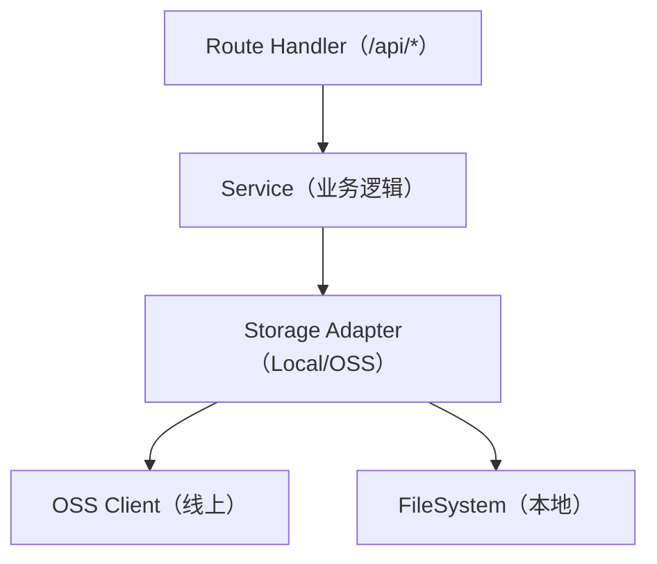
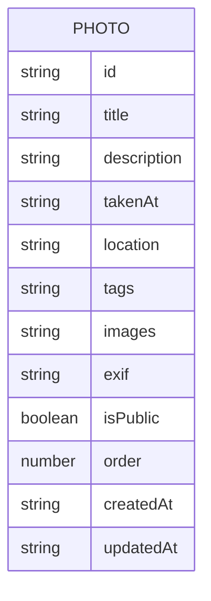

# 摄影作品展示网站（Charles 的相册）- 技术架构文档

## 1. 架构设计



## 2. 技术说明
- 前端：Nuxt 4（Vue 3）+ Tailwind CSS
- Masonry：自实现列分发式（多列渲染，无第三方布局库）
- 服务端：Nuxt Nitro（同仓库 API）
- 数据：不使用数据库；使用 meta/photos.json（Photo[]）作为唯一真源
- 存储：
  - 本地开发：本地文件系统模拟 OSS（local-oss/photos/*、local-oss/meta/photos.json）
  - 线上：阿里云 OSS（photos/original/、photos/thumbnail/、meta/photos.json）
- 鉴权：管理员密码登录 + HttpOnly Cookie（服务端签名会话），有效期 7 天

## 3. 路由定义
| 路由 | 用途 |
|------|------|
| / | 作品瀑布流首页（含详情弹窗，支持 /?photo=id） |
| /admin | 图片管理页（登录后可访问） |

## 4. API 定义

### 4.1 类型定义（Photo）

```ts
export type Photo = {
  id: string
  title: string
  description: string
  takenAt?: string
  location?: string
  tags?: string[]
  images?: {
    original?: string
    thumbnail?: string
  }
  exif?: {
    camera?: string
    lens?: string
    focalLength?: string
    aperture?: string
    shutter?: string
    iso?: number
  }
  isPublic?: boolean
  createdAt?: string
  updatedAt?: string
  order?: number
}
```

### 4.2 鉴权
| 方法 | 路径 | 说明 |
|------|------|------|
| POST | /api/auth/login | 管理员密码登录，Set-Cookie（7 天） |
| POST | /api/auth/logout | 清除 Cookie |
| GET | /api/auth/me | 获取登录态 |

### 4.3 公开接口
| 方法 | 路径 | 说明 |
|------|------|------|
| GET | /api/photos | 读取 meta/photos.json，返回 Photo[]（并按排序策略输出） |
| GET | /api/photos/:id | 返回单个 Photo（用于详情弹窗与 SSR 元信息） |

### 4.4 管理接口（需鉴权）
| 方法 | 路径 | 说明 |
|------|------|------|
| GET | /api/admin/photos | 管理端列表查询（分页/筛选） |
| POST | /api/admin/photos | 服务端转发上传（original + thumbnail）并创建 Photo，写入 meta/photos.json |
| PATCH | /api/admin/photos/:id | 更新元数据（description、tags 等）并写回 meta/photos.json |
| DELETE | /api/admin/photos/:id | 删除图片对象并从 meta/photos.json 移除 |

## 5. 服务端结构（建议）



## 6. 数据模型（元数据 JSON）



